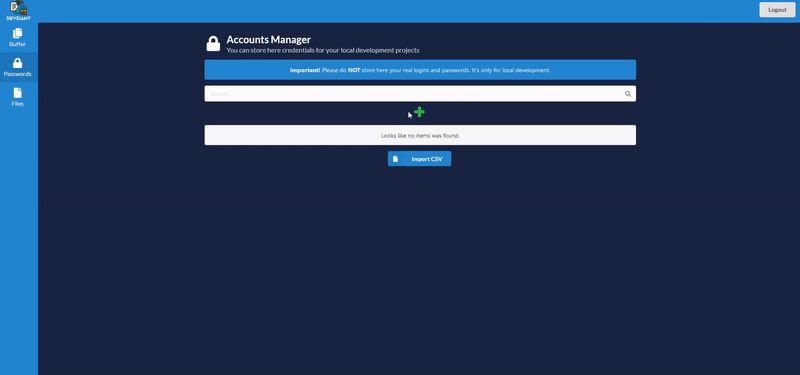

# Devsiant
## Description

In my work I often use several devices for developing and I created this little app to make my routine more comfortable. With this application I can store my local credentials for different services that I'm testing or working with. Another problem, it's to pass some small text data to another device, for example, some code snippet from my main PC to my laptop and I can do this with a module in my app that I called Global Buffer which working with web sockets, text will appear on all devices where the client is running. Also local file storage is a very comfortable thing to share files. As it's a web-application it's easy to access all these features from all devices in the local network.

## Preview
<p align="center">
  
</p>

## How to run
### Without Docker
Backend: <br/>
1. Open your terminal in `server` folder. <br/>
2. Install virtual environment. <br/>
`python3 -m venv env`<br/>
3. Activate virtual environment.<br/>
`source env/bin/activate`<br/>
5. Install requirement packages.<br/>
`pip install -r requirements.txt`<br/>
6. Run application.<br/>
`python3 usgi.py`<br/>

Admin user by default is admin:admin. You can change this in `/src/settings.py`. Also, you can uncomment and use signup endpoints in `/src/api/auth.py`.

Frontend: <br/>
1. Open your terminal in `client` folder. <br/>
2. Change baseURL in `/src/api/baseURL.js`.<br/>
```
export const baseURL = process.env.REACT_APP_ENV === 'production'?process.env.REACT_APP_API_URL + `${process.env.REACT_APP_PORT ? ':' + process.env.REACT_APP_PORT : ''}`
    :"http://{local ip}:{port}"
```
3. Install packages with npm.<br/>
`npm install`<br/>
4. Run application.<br/>
`npm start`<br/>
More options can be found in client readme.md
### With Docker

To run the application with docker all you need to do, it's run `docker-compose up -d` <br/>
Docker compose variables explanation: <br/>
For server: <br/>

* `ADM_USER` - name of admin user
* `ADM_PASSWORD` - password of admin user
* `MAX_FILE_SIZE` - max file size in bytes that can be uploaded to file storage (by default it's 3GB, this application not optimized enough to work with large files, so keep in mind).
* `MAX_CHUNK_SIZE` - max size in bytes of chunk that uses for big size files (by default it's 8192 bytes) For better performance and speed you can try to increase that value.

For client: <br/>
* `env` - by default it's "production" and usually don't need to change.
* `port` - here you need to type the port number that is used for server container. Leave this property blank if the port is not needed.
* `api_url` - the local ip address (don't forget to make this ip permanent in your router settings) or domain-name of the machine where the running server container.
* `max_file_size` - it's value must be equal to `MAX_FILE_SIZE` in server container.

Volume: <br/>
In my case I'm using separate disk mounted to my raspberry pi. Depending on your needs, you should change this setting. Example:
```
volumes:
    - type: bind
        source: /mnt/data
        target: /code/server/src/media
```

## Notes and Features

* **Backend**. As a rest web service for this project I choose python [FastAPI](https://fastapi.tiangolo.com/) framework. I never used FastAPI before, but I really enjoyed working with it. Besides high performance and simplicity, automatic interactive API documentation it's a very good feature. As database I used just [sqlite](https://www.sqlite.org/index.html). Documentation for API available by this url: `http://{your_address}/docs`.
* **Frontend**. For frontend I decided to use [React](https://reactjs.org/), mainly because I had not used this framework before and was interested to try it. To manage application state I used Context API. 
* **Global buffer**. Global buffer is a text area that updating in real time on all opened clients and that allows for fast share text data from different devices. Also, you can save data in buffer and it will appear every time when open the app or you can save that data as a Note. 
* **Passwords manager**. In Passwords manager you can create the projects and add credential data to them. Also, you can export and import these data by csv format files.
* **File manager**. In File manager, you can work with mounted disk or single folder, include possibility to edit filenames, delete files, create folders, upload and download files. Also, you can download multiple files that will archived to one file.
## Todos

* **Files preview**. After some time using file manager it seemed to me that the ability to preview images or other format files will be a good feature.
* **Password generator**. Another good feature Its possibility to generate passwords inside the app.
